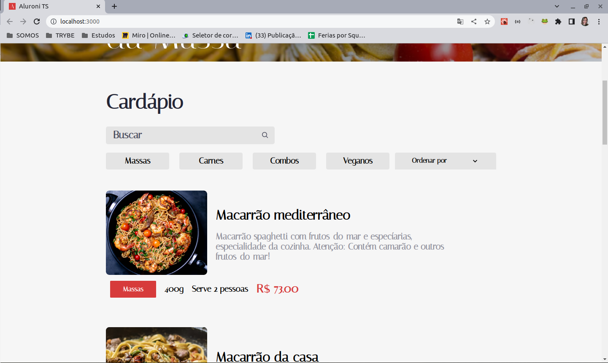
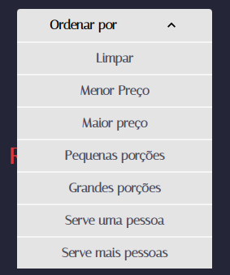
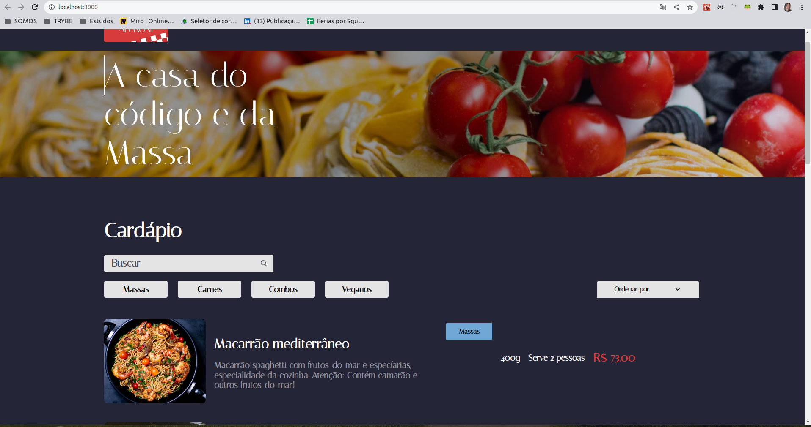

# Projeto Alura-Aluroni

Projeto desenvolvido durante o curso **React: lidando com arquivos estáticos** oferecido pela plataforma **Alura**.

O curso tem como objetivo desenvolver as seguintes tecnologias: React e TypeScript.

Durante o curso eu:

- Criei um projeto do zero com Create React App
- Aprendi a utilizar o normalize.css para resetar estilos padrões de navegadores
- Configurei absolute imports para não precisar mais importar arquivos com vários níveis ('../../../')
- Aprendi boas práticas em CSS como criar variáveis, criar arquivos para estas variáveis e para breakpoints de media-queries
- Utilizei o pacote classnames para poder utilizar o CSS Modules sem precisar concatenar um monte de estilos CSS e lidar com estilos condicionais
- Aprendi como utilizar o SVGR, um pacote que vem no Create React App para importar svgs como componentes React
- Entendei como o React entende os imports estáticos tanto via arquivos .js quanto em arquivos de estilos como .scss ou .css. Aprenda como importar arquivos estáticos como variáveis via js ou utilizando a pasta public para imports dinâmicos de arquivos estáticos

**Conslusão**: 28/08/2022

**URL da aplicação rodando**:

## O que foi proposto:

Uma landing page de um restaurante fictício onde é exibido as opções de pratos composta por:

- Logo do Restaurante;
- Banner com imagem e texto;
- Listagem dos pratos com:
  - Nome do prato;
  - Imagem do prato;
  - Descrição do prato;
  - Tag com o tipo de prato;
  - Preço;
  - Porção;
  - Quantidade de pessoas que serve;
- Filtros com as opções:
  - Input (Para pesquisar pelo nome);
  - Botões (Para filtras as tags);
- Opção de ordenação;

Sugestões de melhorias implementadas por mim:

- Incluir uma opção de limpar o opção de ordenação no campo que ficaria em branco na listagem de ordenaçãoo;
- Implementar opção de Darkmode;
- Mais opções de ordenação;

## Preparando o projeto localmente

### **1º passo:** Baixe o projeto do git

Faça o clone do projeto pra sua máquina

- **URL**: https://github.com/maria-baeta/ts-aluroni

### **2º passo:** Instalando as dependências

Para instalar as dependências do projeto execute o comando:

```bash
$ yarn
```

## Executando localmente

Execute o comando abaixo:

```bash
$ yarn start
```

o VS-Code irá abrir uma instância do Chrome já na url:

```bash
hhttp://localhost:3000/
```

## Dificuldades

- Identificar os tipos referentes as props compartilhada pelos componentes.

## Aprendizados

- Como identificar os tipos especificos

## Como ficou?

Após a conclusão do curso:



O que adicionei:

- Opções de Filtos

  

- Dark mode:

  
